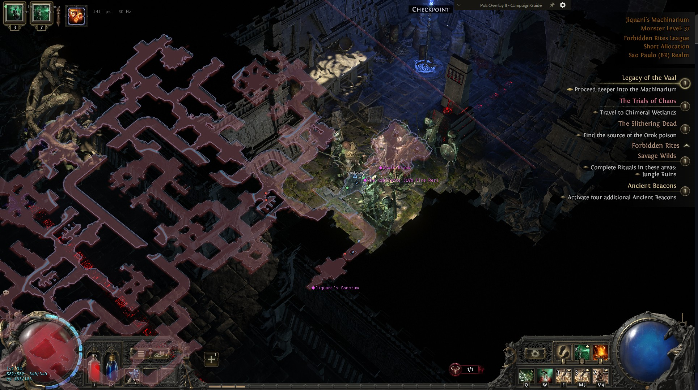
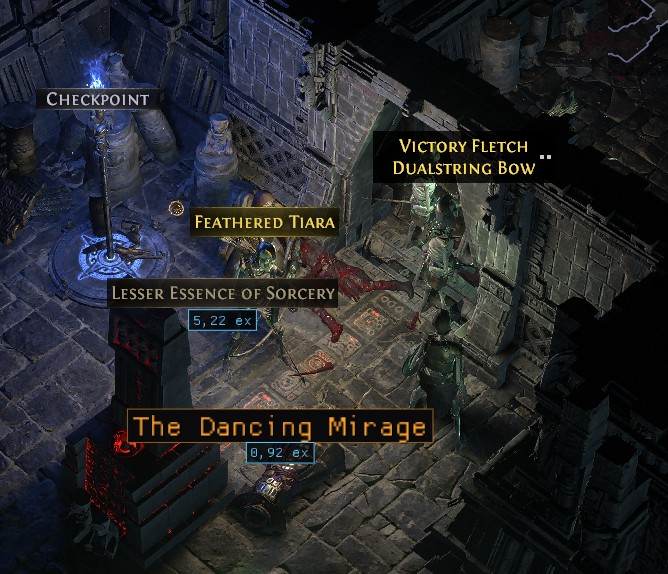
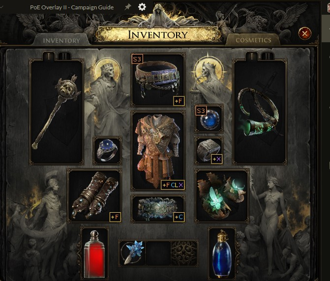



# EasyExile

### A focused Path of Exile 2 utility for mapping, navigation, progression, loot, and combat awareness.

**[⬇ Download the latest release](https://github.com/guilhermesoaresdata-cpu/EasyExile/releases/latest)** — unzip and run, no install needed.

EasyExile combines the information normally spread across the map, UI, item inspection, and progression tools into a configurable external overlay. It is designed to reduce friction without replacing normal gameplay.

## Screenshots

<table>
<tr>
<td width="34%">

**Map, entities, and the campaign guide**

Terrain, walkable area, tracked entities, and the step-by-step campaign guide, all drawn over the game's own map.

</td>
<td>

</td>
</tr>
<tr>
<td>

**Ground loot, priced and named**

A cheap unique ("The Dancing Mirage", 0.92 ex) still gets its real name and price — the value floor that hides common currency never applies to a unique's identity.

</td>
<td>

</td>
</tr>
<tr>
<td>

**Item marks, at a glance**

Two independent marks stack in the corners: a mod-tier badge (`S3` — best suffix roll, tier 3) and which resistance an item fills (`+F` fire, `+C` cold, `+X` chaos) or build archetype it helps. Set your build and target once; every item you look at after that is pre-sorted.

</td>
<td>

</td>
</tr>
</table>

## Features

### Map and exploration

- Native terrain map
- Walkable-area visualization
- Persistent exploration state
- Player and entity tracking
- Transitions, landmarks, chests, NPCs, and relevant world objects
- Configurable icons, labels, colors, and display rules
- Game-map alignment

### Navigation

- Terrain-aware route calculation
- Automatic route replanning
- Path smoothing
- Destination and progress tracking
- World and map route display

Navigation is visual only and does not control character movement.

### Campaign

- Current-area recognition
- Campaign route and area graph across 65 zones and 190 steps
- Progress journal
- Current and next objective
- Step and route guidance
- The whole guide in either language, keyed by the client's internal area codes
  so it does not depend on the client's own language

### Entities and combat

- Entity classification
- Monster rarity and relation
- Monster health bars
- Threat-focused display
- Player life, mana, energy shield, and position
- Stable markers for moving entities

### Loot and items

- Ground-item labels
- Item value information
- Hovered-item pricing
- Uniques with no known price are marked rather than hidden
- Inventory-slot highlighting
- Modifier tier badges on the item's own tooltip line, by prefix and suffix
- Build-archetype marks — pick what you are building and items carrying mods
  that help it get a corner mark
- Resistance marks — either what your character is still short of, against a
  target you choose, or the elements you pick yourself
- Curated support-gem recommendations for 381 skills

### Language

- The entire interface in Portuguese (BR) or English, switched at any time
- Every phrase the overlay can draw, including the campaign guide and the text
  drawn over the game
- Two guards in the test suite: one fails on a phrase with no translation, the
  other on a drawn string that never reached the translator at all

### AutoPotion

- Life, mana, and energy-shield conditions
- Configurable thresholds, keys, and cooldowns
- Foreground-window and valid-area checks
- Invalid-vitals protection
- Dry-run mode
- F8 kill switch
- Disabled by default

> AutoPotion is the only feature that sends keyboard input. Automation may conflict with current game rules or account policies; use it only after reviewing those rules.

## Key characteristics

- **External overlay** — no process injection or renderer hooking.
- **Read-only game data** — EasyExile does not write to game memory.
- **Build validation** — incompatible game builds are rejected instead of using stale layouts.
- **Fail-closed behavior** — invalid data disables the affected feature rather than producing guessed results.
- **Modular configuration** — map, navigation, campaign, loot, health bars, player display, and AutoPotion can be configured independently.
- **Area-aware state** — routes, entities, exploration, and temporary caches are refreshed on area changes.
- **Independent update and render loops** — data capture does not block presentation.

## Feature status

| Module | Capabilities |
| --- | --- |
| Native Map | Terrain, exploration, entities, icons, labels, landmarks, map alignment |
| Navigation | A* routing, smoothing, targets, route tracking, background replanning |
| Campaign | Area graph, journal, objectives, step panel, route guidance |
| Combat | Player vitals, entity rarity, health bars, threat information |
| Loot | Ground labels, pricing, unpriced uniques, item slots, mod tier badges, build marks, resistance marks, support advice |
| Language | Full Portuguese (BR) and English interface, campaign guide included, guarded by tests |
| AutoPotion | Optional flask input with thresholds, cooldowns, dry run, and kill switch |
| Diagnostics | Chain, area, transition, camera, UI, tooltip, map, slot, and loot inspection; aimed UI-tree dumps with element paths, read recipes, raw field values, value search, and offline diff |

## Compatibility

EasyExile depends on a build-specific memory-layout contract. A Path of Exile 2 update can temporarily disable live features until a matching validated contract is available.

The application deliberately refuses incompatible layouts. Test coverage verifies internal behavior but does not make an old contract compatible with a new game build.

## Project status

EasyExile is under private active development. Features and layouts may change as the game client evolves.

## Technical documentation

Developer documentation is kept separate from the product overview:

- [Module reference](docs/MODULES.md)
- [Architecture and data flow](docs/ARCHITECTURE.md)
- [Feature implementation](docs/FEATURES.md)
- [Development and testing](docs/DEVELOPMENT.md)
- [Offset contract workflow](CONTRACT_WORKFLOW.md)
- [Overlay backend](src/EasyExile.Radar/Overlay/BACKEND.md)

---

Not affiliated with or endorsed by Grinding Gear Games.

